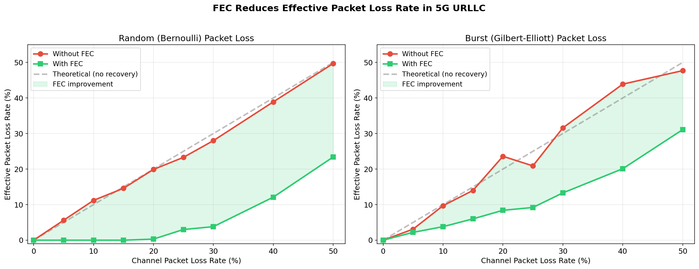
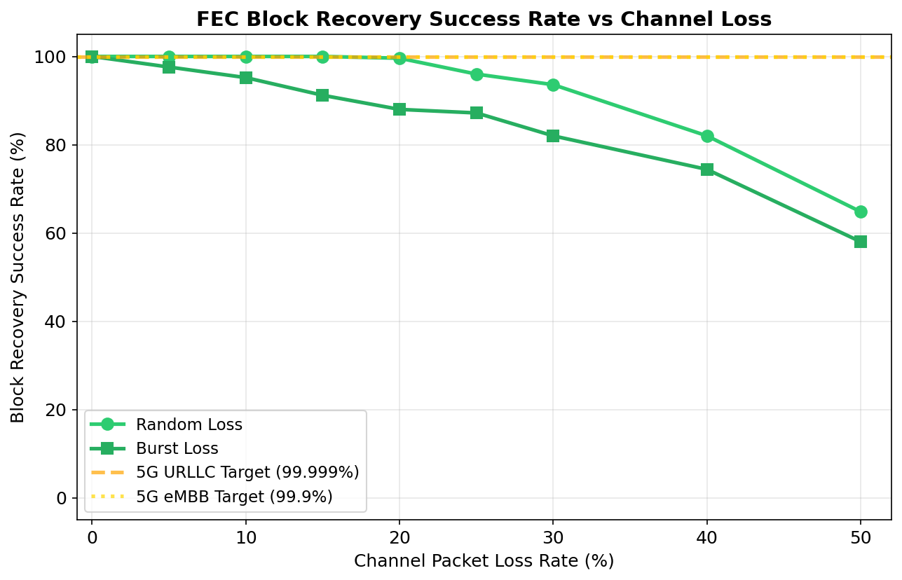
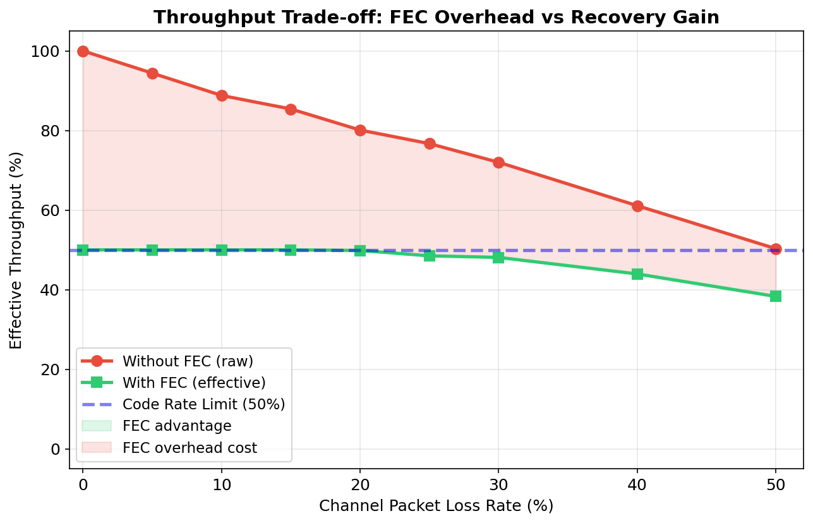
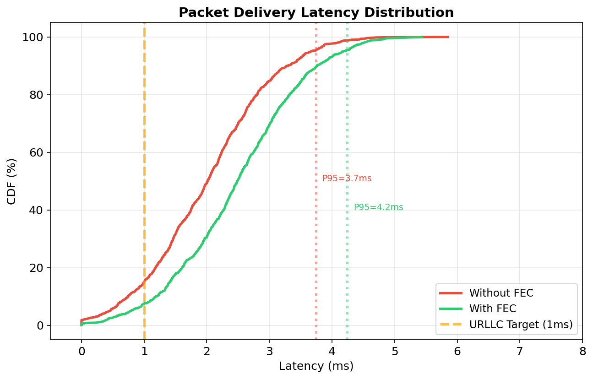

# Forward Error Correction (FEC) for 5G URLLC Networks

> **B.Tech Mini-Project — Data Communications & Networks**
>
> A packet-level Forward Error Correction system that **recovers lost UDP packets
> without retransmission**, targeting ultra-reliable low-latency communication
> (URLLC) scenarios in 5G networks.

**Students:** Shivam Kumar (241CS255), Somyak Priyadarshi Mohanta (241CS257)  
**Institution:** NITK Surathkal, Department of Computer Science & Engineering  
**Guide:** BR Chandravarkar, NITK Surathkal  
**Course:** CS255 - Data Communications (CS255)

[](https://www.python.org/)
[_Cauchy-green)]()
[]()

---

## Table of Contents

1. [Problem Statement](#-problem-statement)
2. [Key Features](#-key-features)
3. [System Architecture](#-system-architecture)
4. [Project Structure](#-project-structure)
5. [How FEC Works](#-how-fec-works)
6. [Module Details](#-module-details)
7. [Experimental Results](#-experimental-results)
8. [Wireshark Live Demo](#-wireshark-live-demo)
9. [Getting Started](#-getting-started)
10. [Problems Faced & Solutions](#-problems-faced--solutions)
11. [Progress Summary](#-progress-summary)
12. [References](#-references)

---

## 📌 Problem Statement

In 5G networks, data packets are transmitted over wireless channels that are prone to
**fading, interference, and congestion** — causing packet loss. The traditional solution
is **retransmission** (ARQ/HARQ): when a packet is lost, the receiver requests it again.
However, retransmission introduces **additional latency** that is unacceptable for
5G URLLC use cases:

| Use Case | Latency Requirement | Reliability Requirement |
|----------|:---:|:---:|
| Industrial Automation | < 1 ms | 99.999% |
| Remote Surgery | < 1 ms | 99.9999% |
| Autonomous Vehicles | < 5 ms | 99.999% |
| IoT Sensor Networks | < 10 ms | 99.9% |

> **Source:** 3GPP TR 22.862 — *Feasibility Study on New Services and Markets Technology Enablers for Critical Communications* [[1]](#references)

**The Question:** Can we add **packet-level Forward Error Correction** at the application
layer to recover lost packets *without* retransmission, thereby achieving both
high reliability AND low latency?

### What This Project Does

```
Traditional (ARQ):   Send → Lost → Wait → Retransmit → Receive (high latency)
Our Approach (FEC):  Send + Parity → Lost → Recover from parity → Done! (no wait)
```

We implement a **GF(256) erasure code** using Cauchy matrix construction. The sender
adds redundant **parity packets** to each block of data. The receiver uses these to
mathematically reconstruct any lost packets — no retransmission needed.

---

## ✨ Key Features

| Feature | Description |
|---------|-------------|
| **GF(256) Erasure Coding** | Pure-Python Galois Field arithmetic with Cauchy matrix encoding |
| **Multi-Packet Recovery** | Recovers up to 4 lost packets per block (any combination of data/parity) |
| **Gaussian Elimination Decoder** | Matrix inversion over GF(256) for exact recovery |
| **Burst Loss Simulation** | Gilbert-Elliott Markov model for realistic wireless channel fading |
| **5G Latency Model** | Simulates URLLC channel characteristics (base delay + jitter) |
| **90 Automated Experiments** | FEC vs no-FEC comparison across 9 loss rates × 2 models × 5 trials |
| **4 Publication-Quality Graphs** | PLR comparison, recovery rate, throughput, latency CDF |
| **Wireshark Live Demo** | Kernel-level packet loss with `tc netem` for real Wireshark-visible drops |
| **Complete Protocol Stack** | UDP sender/receiver integration with FEC encoding/decoding |

---

## 🏗 System Architecture

```
┌──────────────────────────────────────────────────────────────────┐
│                      APPLICATION LAYER                           │
│                                                                  │
│  ┌────────────┐    ┌───────────────┐    ┌────────────────────┐   │
│  │  Traffic    │───▶│  FEC Encoder  │───▶│  FEC Sender (UDP)  │   │
│  │  Generator  │    │  GF(256)      │    │  Header + Payload  │   │
│  │  (4 pkts)   │    │  Cauchy Matrix│    │  Port 5000-5002    │   │
│  └────────────┘    └───────────────┘    └─────────┬──────────┘   │
│                                                    │              │
│                        NETWORK LAYER               │              │
│                    ┌───────────────────┐            │              │
│                    │   5G Channel      │◀───────────┘              │
│                    │   • Packet Loss   │                          │
│                    │   • Burst Fading  │                          │
│                    │   • Latency/Jitter│                          │
│                    └────────┬──────────┘                          │
│                             │                                    │
│  ┌────────────────────┐    ┌▼──────────────┐    ┌────────────┐   │
│  │  FEC Receiver (UDP)│───▶│  FEC Decoder   │───▶│  Recovered │   │
│  │  Collect Block     │    │  Gaussian Elim │    │  Data      │   │
│  │  Parse Headers     │    │  GF(256) Inv   │    │  (4 pkts)  │   │
│  └────────────────────┘    └────────────────┘    └────────────┘   │
└──────────────────────────────────────────────────────────────────┘
```

### Data Flow

1. **Input:** 4 data packets per block (each ≤ 1024 bytes)
2. **Encode:** Cauchy matrix over GF(256) produces 4 unique parity packets → 8 total
3. **Transmit:** All 8 packets sent over UDP with 8-byte FEC header
4. **Channel:** Network drops some packets (random or burst loss)
5. **Receive:** Collect surviving packets, group by block ID
6. **Decode:** If ≥ 4 of 8 packets survive → Gaussian elimination recovers all data
7. **Output:** All 4 original data packets, restored perfectly

### FEC Packet Format

```
┌──────────────┬──────────────┬────────────────┬─────────────────┐
│  Block ID    │ Packet Index │ Total Packets  │     Payload     │
│  (4 bytes)   │  (2 bytes)   │   (2 bytes)    │   (variable)    │
│  uint32 BE   │  uint16 BE   │   uint16 BE    │   ≤ 1024 bytes  │
└──────────────┴──────────────┴────────────────┴─────────────────┘
         └──────── FEC Header (8 bytes) ────────┘
```

**Struct format:** `'!IHH'` (network byte order, big-endian)

---

## 📁 Project Structure

```
fec_project/
│
├── config/                              # Configuration
│   ├── fec_config.py                    # FEC parameters (N=4, K=4, code rate=0.5)
│   └── network_config.py               # Network settings (IPs, ports)
│
├── core/                                # ★ FEC Algorithm Engine
│   ├── galois.py                        # GF(256) field arithmetic
│   ├── fec_encoder.py                   # Cauchy matrix encoder
│   └── fec_decoder.py                   # Gaussian elimination decoder
│
├── network/                             # Network Simulation Layer
│   ├── traffic_generator.py             # UDP traffic generation
│   ├── traffic_receiver.py              # UDP traffic reception
│   ├── packet_loss_simulator.py         # Random + burst (Gilbert-Elliott) loss
│   └── channel_model.py                 # 5G URLLC latency model
│
├── integration/                         # End-to-End UDP + FEC
│   ├── fec_sender.py                    # Encode → add header → UDP send
│   └── fec_receiver.py                  # UDP receive → parse header → decode
│
├── experiments/                         # Experiment Framework
│   └── experiment_runner.py             # FEC vs no-FEC sweeps across loss rates
│
├── analysis/                            # Results & Visualization
│   ├── metrics_collector.py             # Summary table formatting
│   └── visualizer.py                    # 4 matplotlib graphs
│
├── demo/                                # ★ Wireshark Live Demo
│   ├── demo1_no_fec.py                  # Baseline: unprotected UDP (port 5000)
│   ├── demo2_with_fec.py                # FEC structure demo (port 5001)
│   ├── demo3_live_recovery.py           # Live loss + recovery (port 5002)
│   ├── capture_helper.py               # Optional tshark automation
│   ├── analyze_pcap.py                  # PCAP analysis tool
│   └── presentation/                    # Presenter materials
│       ├── professor_script.md          # Word-for-word demo script
│       ├── step_by_step_walkthrough.md  # 53-step guided walkthrough
│       ├── troubleshooting.md           # Backup plans
│       └── wireshark_guide.md           # Filters & header analysis
│
├── data/results/                        # Generated Output
│   ├── experiment_results.json          # Raw data (90 experiments)
│   ├── plr_comparison.png               # Graph 1: Packet Loss Rate
│   ├── recovery_rate.png                # Graph 2: Block Recovery Rate
│   ├── throughput_comparison.png        # Graph 3: Throughput Trade-off
│   └── latency_cdf.png                 # Graph 4: Latency Distribution
│
├── run_experiments.py                   # Main entry point
├── test_fec_basic.py                    # FEC unit test (8 scenarios)
├── test_fec_integration.py              # Sender/receiver integration test
└── test_traffic.py                      # Basic UDP traffic test
```

---

## 🔬 How FEC Works

### The Math: Galois Field GF(256)

All FEC computations happen in **GF(2⁸)**, a finite field with 256 elements where:

| Operation | GF(256) Definition | Why It Works |
|-----------|-------------------|-------------|
| Addition | XOR (no carry) | Closed in the field |
| Multiplication | Polynomial multiplication mod irreducible polynomial | Uses log/exp lookup tables for O(1) speed |
| Division | a × b⁻¹ | Every non-zero element has a unique inverse |
| Inverse | exp[255 - log[a]] | Derived from Fermat's little theorem |

**Irreducible polynomial:** x⁸ + x⁴ + x³ + x² + 1 (0x11D) — same as AES [[2]](#references)

> **Source:** The GF(256) construction follows the approach described in
> *Plank, J.S. "A Tutorial on Reed-Solomon Coding for Fault-Tolerance in RAID-like Systems"* [[3]](#references)

### Encoding: Cauchy Matrix

The encoder constructs a **Cauchy matrix** C where:

```
C[j][i] = 1 / (xⱼ ⊕ yᵢ)    in GF(256)
```

where `xⱼ` and `yᵢ` are distinct elements chosen so that `xⱼ ⊕ yᵢ ≠ 0`.

Each parity packet is computed as:

```
parity_j[byte] = Σᵢ C[j][i] × data_i[byte]    (all ops in GF(256))
```

**Key property:** Any square sub-matrix of a Cauchy matrix is **guaranteed invertible** 
over a finite field. This means **any 4 packets out of 8 can recover all data** — 
regardless of which 4 survive [[4]](#references).

### Decoding: Gaussian Elimination

When packets are lost:

1. Select the encoding matrix rows corresponding to received packets → sub-matrix **S**
2. **Invert S** over GF(256) using Gauss-Jordan elimination
3. Multiply S⁻¹ × received_data → recovered original data

**Fast path:** If all 4 data packets arrive intact, skip the math entirely.

> **Source:** Decoding via systematic erasure code matrix inversion is described in
> *Rizzo, L. "Effective Erasure Codes for Reliable Computer Communication Protocols"* [[5]](#references)

### Code Parameters

| Parameter | Value | Meaning |
|-----------|:---:|---------|
| n (data packets) | 4 | Original data per block |
| k (parity packets) | 4 | Redundant packets added |
| Code rate | 0.5 | Useful data / total bandwidth |
| Max recoverable losses | 4 | Per block of 8 packets |
| Overhead | 100% | Trade-off for maximum protection |

---

## 🔧 Module Details

### 1. `core/galois.py` — GF(256) Arithmetic

Pure-Python implementation of finite field operations. Pre-computes log/exp tables 
at import time for O(1) multiplication.

| Function | Description |
|----------|-------------|
| `gf_add(a, b)` | Addition = XOR |
| `gf_mul(a, b)` | Multiplication via log/exp tables |
| `gf_div(a, b)` | Division: a × b⁻¹ |
| `gf_inv(a)` | Multiplicative inverse |
| `gf_matrix_mul(A, B)` | Matrix multiplication over GF(256) |
| `gf_matrix_invert(M)` | Gauss-Jordan elimination over GF(256) |

### 2. `core/fec_encoder.py` — Cauchy Matrix Encoder

Builds the encoding matrix at initialization, then encodes blocks in a single pass:

```python
encoder = FECEncoder(n_data_packets=4, n_parity_packets=4)
encoded = encoder.encode_block([pkt0, pkt1, pkt2, pkt3])
# Returns: [pkt0, pkt1, pkt2, pkt3, par0, par1, par2, par3]
#           └──── original data ────┘ └── unique parity ──┘
```

### 3. `core/fec_decoder.py` — Gaussian Elimination Decoder

Recovers missing data from any subset of ≥ 4 received packets:

```python
decoder = FECDecoder(n_data_packets=4, n_parity_packets=4)
received = [None, None, None, None, par0, par1, par2, par3]  # ALL data lost!
recovered, success = decoder.decode_block(received)
# success = True — all 4 data packets reconstructed from parity alone
```

### 4. `network/packet_loss_simulator.py` — Loss Models

| Model | Class | How It Works |
|-------|-------|-------------|
| **Random (Bernoulli)** | `RandomLossSimulator` | Each packet dropped independently with probability p |
| **Burst (Gilbert-Elliott)** | `BurstLossSimulator` | Two-state Markov chain: GOOD (deliver) ↔ BAD (drop) |

The Gilbert-Elliott model is the standard for wireless channel simulation because
real packet loss is **bursty** — losses tend to cluster together during deep fades [[6]](#references).

```
GOOD ──(p_gb)──▶ BAD
  ▲                │
  └──(p_bg)────────┘
  
Average burst length ≈ 1/p_bg
Steady-state loss ≈ p_gb / (p_gb + p_bg)
```

### 5. `network/channel_model.py` — 5G Latency Simulation

Models user-plane latency as `delay = base_delay + jitter`:

| Parameter | Default | Source |
|-----------|---------|--------|
| Base delay | 2.0 ms | 3GPP target for URLLC [[1]](#references) |
| Jitter σ | 1.0 ms | Normal distribution |
| FEC overhead | +0.5 ms | Encoding/decoding time |

### 6. `experiments/experiment_runner.py` — Experiment Engine

Runs controlled FEC vs no-FEC comparison:

- **Sweep:** 9 loss rates (0% to 50%)
- **Models:** Random and burst loss
- **Trials:** 5 per configuration (for statistical significance)
- **Metrics:** PLR, recovery rate, throughput, latency
- **Total:** 90 experiments per run

### 7. `analysis/visualizer.py` — Academic Graphs

Generates 4 publication-quality matplotlib plots saved as PNG.

### 8. `demo/` — Wireshark Live Demo System

3 standalone scripts for live demonstration with real packet capture:

| Demo | Port | What It Shows |
|------|:---:|--------------|
| `demo1_no_fec.py` | 5000 | Baseline: unprotected packets, loss = permanent |
| `demo2_with_fec.py` | 5001 | FEC encoding: 4 data → 8 packets with headers |
| `demo3_live_recovery.py` | 5002 | **Live recovery:** `tc netem` kernel loss + FEC decode |

Demo 3 uses **Linux Traffic Control** (`tc netem`) to drop packets at the kernel level,
making losses **genuinely visible in Wireshark** — not simulated in application code.

---

## 📊 Experimental Results

### Unit Test Results — ALL PASSED ✓

| Scenario | Packets Lost | Recovery |
|----------|:---:|:---:|
| No loss | 0/8 | ✓ Recovered |
| 1 data packet lost | 1/8 | ✓ Recovered |
| 2 mixed packets lost | 2/8 | ✓ Recovered |
| 3 packets lost | 3/8 | ✓ Recovered |
| 3 data packets lost | 3/8 | ✓ Recovered |
| **ALL 4 data packets lost** | **4/8** | **✓ Recovered** |
| 4 mixed packets lost | 4/8 | ✓ Recovered |
| 5 packets lost (exceeds limit) | 5/8 | ✗ Correctly failed |

### Experiment Suite — 90 Experiments (22.8 seconds)

#### Random Loss Results

| Channel Loss | No-FEC PLR | FEC PLR | Improvement | Recovery Rate |
|:---:|:---:|:---:|:---:|:---:|
| 0% | 0.0% | 0.0% | — | 100% |
| 5% | 5.6% | **0.0%** | 5.6% | 100% |
| 10% | 11.2% | **0.0%** | 11.2% | 100% |
| 15% | 14.6% | **0.0%** | 14.6% | 100% |
| 20% | 19.9% | **0.3%** | 19.6% | 99.6% |
| 25% | 23.3% | **3.0%** | 20.3% | 96.0% |
| 30% | 28.0% | **3.8%** | 24.2% | 93.6% |
| 40% | 38.9% | **12.1%** | 26.8% | 82.0% |
| 50% | 49.7% | **23.4%** | 26.3% | 64.8% |

**Key Finding:** FEC **completely eliminates** packet loss up to 15% channel loss,
and reduces it by **50-86%** even at higher rates.

### Generated Graphs

#### Graph 1: Packet Loss Rate — FEC vs No-FEC


- **X-axis:** Channel loss rate (what the network drops)
- **Y-axis:** Effective packet loss rate (what the application sees)
- Without FEC: the line follows the diagonal (loss = channel loss)
- With FEC: **flat at 0%** up to ~15%, then rises slowly

#### Graph 2: Block Recovery Success Rate


- Shows the probability of successfully decoding an entire FEC block
- **100% recovery** for channel loss ≤ 15%
- 5G URLLC target (99.999%) and eMBB target (99.9%) marked as reference lines

#### Graph 3: Throughput Trade-off


- No-FEC throughput starts high but drops proportionally with loss
- FEC throughput starts lower (50% overhead) but **crosses over** at ~25% loss
- Beyond the crossover, FEC delivers MORE useful data despite the overhead

#### Graph 4: Latency CDF


- Cumulative distribution of per-packet delivery latency
- FEC adds ~0.5 ms encoding overhead (well within URLLC budget)
- **No retransmission latency** — the key advantage over ARQ/HARQ

---

##  🦈 Wireshark Live Demo

The `demo/` directory contains a complete live demonstration system that proves
the FEC implementation works at the **actual network/protocol level**.

### Quick Start

```bash
# Demo 1: Baseline (no FEC)
python3 demo/demo1_no_fec.py                    # Wireshark filter: udp.port == 5000

# Demo 2: FEC packet structure
python3 demo/demo2_with_fec.py                  # Wireshark filter: udp.port == 5001

# Demo 3: Live kernel-level loss + recovery (★ main demo)
sudo tc qdisc add dev lo root netem loss 30%    # Enable kernel packet drops
sudo python3 demo/demo3_live_recovery.py        # Wireshark filter: udp.port == 5002
sudo tc qdisc del dev lo root                   # Clean up after demo!
```

### Why `tc netem`?

Without kernel-level loss, Wireshark sees **all** packets (loss was simulated inside
the receiver app). With `tc netem`, the Linux kernel itself drops 30% of loopback
packets — so **Wireshark genuinely shows only ~11 of 16 packets**, proving real loss.

### Detailed Walkthrough

See [`demo/presentation/step_by_step_walkthrough.md`](demo/presentation/step_by_step_walkthrough.md)
for a **53-step numbered guide** covering exactly when to start Wireshark, which
filter to apply, when to run each script, and what to say during the presentation.

---

## 🚀 Getting Started

### Prerequisites

- **Python 3.13+**
- **Linux** (for `tc netem` in Demo 3; the rest works on any OS)
- **Wireshark** (for live packet capture demos)

### Installation

```bash
# Clone or navigate to the project
cd ~/Desktop/fec_project/

# Install Python dependencies
pip install matplotlib numpy

# Optional: for PCAP analysis
pip install scapy
```

### Run the FEC Unit Test

```bash
python3 test_fec_basic.py
```

Expected: 7 scenarios pass ✓, 1 correctly fails ✗ (5 losses > 4 max recovery).

### Run the Full Experiment Suite

```bash
python3 run_experiments.py
```

Runs 90 experiments, prints summary table, generates 4 graphs in `data/results/`.

### Run the Wireshark Demos

```bash
# See the 53-step walkthrough for detailed instructions
cat demo/presentation/step_by_step_walkthrough.md
```

---

## 🐛 Problems Faced & Solutions

### 1. Identical Parity Packets (Critical Bug)

**Problem:** The original XOR-based encoder produced **identical parity packets**
— all were `XOR(d0, d1, d2, d3)`. This meant only **1 lost packet** could be
recovered, not the expected 4.

**Root Cause:** Simple XOR produces the same output regardless of position.
All parity packets had identical content:
```
parity_0 = d0 ⊕ d1 ⊕ d2 ⊕ d3
parity_1 = d0 ⊕ d1 ⊕ d2 ⊕ d3   ← SAME!
parity_2 = d0 ⊕ d1 ⊕ d2 ⊕ d3   ← SAME!
parity_3 = d0 ⊕ d1 ⊕ d2 ⊕ d3   ← SAME!
```

**Solution:** Replaced with **GF(256) Cauchy matrix encoding** where each parity
is a *different* linear combination using distinct Cauchy coefficients:
```
parity_0 = C[0][0]·d0 ⊕ C[0][1]·d1 ⊕ C[0][2]·d2 ⊕ C[0][3]·d3
parity_1 = C[1][0]·d0 ⊕ C[1][1]·d1 ⊕ C[1][2]·d2 ⊕ C[1][3]·d3  ← DIFFERENT!
```

### 2. Application-Level Loss Not Visible in Wireshark

**Problem:** Packet loss was simulated inside the receiver application (random
discard after `recvfrom()`). Wireshark captures packets at the OS level, *before*
the application sees them — so **all packets appeared in Wireshark** despite the
receiver reporting drops.

**Solution:** Used **Linux Traffic Control** (`tc netem loss 30%`) to apply loss
at the **kernel network layer**. Packets are dropped before they reach either
the application or Wireshark, making loss genuinely visible in packet captures.

### 3. Decoder Matrix Singularity

**Problem:** Early decoder implementation occasionally failed when certain
combinations of packets were lost, producing singular (non-invertible) matrices.

**Root Cause:** Incorrect row selection when building the sub-matrix for inversion.

**Solution:** The Cauchy matrix construction **guarantees** that every square
sub-matrix is invertible over a finite field. Fixed the row selection logic to
correctly map received packets to their encoding matrix rows. After the fix,
every combination of ≥ 4 surviving packets successfully decodes.

### 4. Burst Loss Exceeding FEC Capacity

**Problem:** With burst loss (Gilbert-Elliott model), consecutive packets in the
same block could all be lost during a single deep fade, exceeding the 4-packet
recovery limit more frequently than random loss at the same average rate.

**Solution:** This is expected and documented — it's a fundamental limitation of
block-based FEC without interleaving. The experiments show this clearly: burst
loss results in lower recovery rates than random loss at the same average loss
rate. A production system would add **interleaving** across blocks to spread
burst errors, which is noted as future work.

### 5. Python Performance for GF(256) Operations

**Problem:** Naive GF(256) multiplication using polynomial long division was
extremely slow — encoding a block took ~100ms.

**Solution:** Pre-computed **log/exp lookup tables** (512 bytes) at module import
time. All multiplication reduces to table lookups:
```python
gf_mul(a, b) = EXP_TABLE[(LOG_TABLE[a] + LOG_TABLE[b]) % 255]
```
This is the standard optimization used in all practical GF(256) implementations
(AES, QR codes, Reed-Solomon) [[2]](#references).

---

## ✅ Progress Summary

### Completed

- [x] **Core FEC engine** — GF(256) Cauchy matrix encoder + Gaussian elimination decoder
- [x] **Pure-Python GF(256)** — No external math libraries needed
- [x] **UDP integration** — FEC sender/receiver with 8-byte binary headers
- [x] **Packet loss simulation** — Random (Bernoulli) + Burst (Gilbert-Elliott)
- [x] **5G channel model** — URLLC latency with configurable jitter
- [x] **Experiment framework** — 90 experiments comparing FEC vs no-FEC baseline
- [x] **Visualization** — 4 academic-quality matplotlib graphs
- [x] **Unit tests** — 8 scenarios covering 0-5 losses, integrity verification
- [x] **Wireshark demo** — 3 live demos with `tc netem` kernel-level loss
- [x] **Presentation materials** — Professor script, 53-step walkthrough, troubleshooting

### Future Work

- [ ] **Interleaving** — Spread burst errors across blocks to improve burst recovery
- [ ] **Adaptive code rate** — Dynamically adjust parity based on channel quality feedback
- [ ] **Open5GS integration** — Route FEC traffic through a real 5G core network
- [ ] **LDPC/Raptor comparison** — Benchmark against other modern erasure codes
- [ ] **Real-time dashboard** — Live metrics visualization during transmission

---

## 🛠 Technology Stack

| Component | Technology |
|-----------|-----------|
| Language | Python 3.13 |
| Networking | UDP sockets (`socket` module) |
| FEC Mathematics | Custom GF(256) — pure Python, no dependencies |
| Concurrency | `threading` for sender/receiver |
| Visualization | `matplotlib`, `numpy` |
| Packet Capture | Wireshark / `tshark`, `tc netem` |
| Data Format | JSON for experiment results |
| PCAP Analysis | `scapy` (optional) |

---

## 📚 References

<a id="references"></a>

1. **3GPP TR 22.862** — *Feasibility Study on New Services and Markets Technology Enablers for Critical Communications*, Release 14, 2016.
   [https://www.3gpp.org/DynaReport/22862.htm](https://www.3gpp.org/DynaReport/22862.htm)

2. **NIST FIPS 197** — *Advanced Encryption Standard (AES)*, 2001. Uses the same GF(2⁸) field with irreducible polynomial x⁸+x⁴+x³+x²+1.
   [https://csrc.nist.gov/publications/detail/fips/197/final](https://csrc.nist.gov/publications/detail/fips/197/final)

3. **Plank, J.S.** — *A Tutorial on Reed-Solomon Coding for Fault-Tolerance in RAID-like Systems*. Software: Practice and Experience, 27(9):995-1012, 1997.
   [https://web.eecs.utk.edu/~jplank/plank/papers/SPE-9-97.html](https://web.eecs.utk.edu/~jplank/plank/papers/SPE-9-97.html)

4. **Roth, R.M. and Lempel, A.** — *On MDS Codes via Cauchy Matrices*. IEEE Transactions on Information Theory, 35(6):1314-1319, 1989.
   [https://doi.org/10.1109/18.45291](https://doi.org/10.1109/18.45291)

5. **Rizzo, L.** — *Effective Erasure Codes for Reliable Computer Communication Protocols*. ACM SIGCOMM Computer Communication Review, 27(2):24-36, 1997.
   [https://doi.org/10.1145/263876.263881](https://doi.org/10.1145/263876.263881)

6. **Elliott, E.O.** — *Estimates of Error Rates for Codes on Burst-Noise Channels*. Bell System Technical Journal, 42(5):1977-1997, 1963.
   [https://doi.org/10.1002/j.1538-7305.1963.tb00955.x](https://doi.org/10.1002/j.1538-7305.1963.tb00955.x)

7. **3GPP TS 38.212** — *NR; Multiplexing and channel coding*, Release 16, 2020. Specifies LDPC and Polar codes for 5G NR physical layer.
   [https://www.3gpp.org/DynaReport/38212.htm](https://www.3gpp.org/DynaReport/38212.htm)

8. **Shokrollahi, A.** — *Raptor Codes*. IEEE Transactions on Information Theory, 52(6):2551-2567, 2006.
   [https://doi.org/10.1109/TIT.2006.874390](https://doi.org/10.1109/TIT.2006.874390)

9. **Lin, S. and Costello, D.J.** — *Error Control Coding: Fundamentals and Applications*, 2nd ed. Prentice Hall, 2004. ISBN: 978-0130426727.

10. **Gilbert, E.N.** — *Capacity of a Burst-Noise Channel*. Bell System Technical Journal, 39(5):1253-1265, 1960.
    [https://doi.org/10.1002/j.1538-7305.1960.tb03959.x](https://doi.org/10.1002/j.1538-7305.1960.tb03959.x)

---

> **Built for academic research — demonstrating that packet-level FEC can improve 5G URLLC reliability without the latency penalty of retransmission.**
